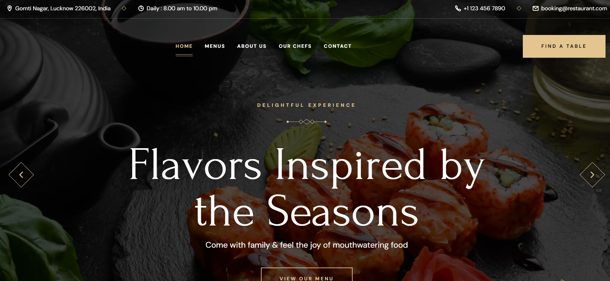

<div align="center">

  
  
  
  
  <br />
  <br />

  <h2 align="center">Maharaja Feast - Restaurant Website</h2>

  Maharaja Feast is a fully responsive restaurant website, <br />Responsive across all devices, built using HTML, CSS, and JavaScript.

  <a href="https://nishantdeswal1810.github.io/maharajaFeast/"><strong>➥ Live Demo</strong></a>

</div>

<br />

### Demo Screenshot



### Prerequisites

Before you begin, ensure you have met the following requirements:

* [Git](https://git-scm.com/downloads "Download Git") must be installed on your operating system.

### Run Locally

To run **Maharaja Feast** locally, run this command on your git bash:

Linux and macOS:

```bash
sudo git clone https://github.com/nishantdeswal1810/maharajaFeast.git

```

Windows:

```bash
git clone https://github.com/nishantdeswal1810/maharajaFeast.git

```

### Contact

If you want to contact with me you can reach me at [Linkedin](https://www.linkedin.com/in/nishantdeswal18).

### License

[MIT](https://choosealicense.com/licenses/mit/)
